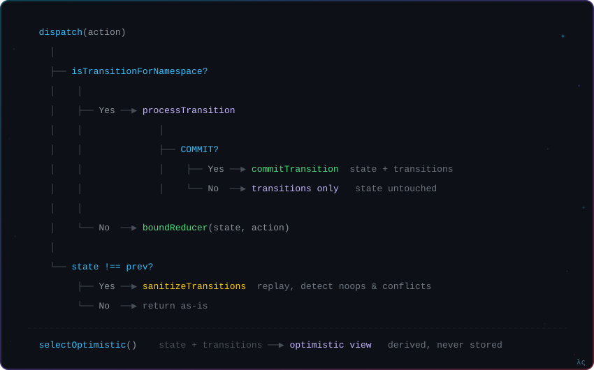
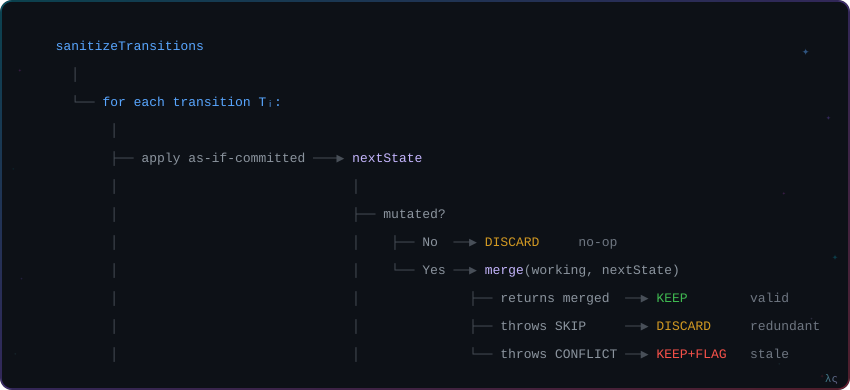

# Architecture

Internals, design decisions, and the full API reference. For getting started, see [README.md](./README.md).

---

- [Data Flow](#data-flow)
- [Entity Identity](#entity-identity)
- [Versioning & Conflict Detection](#versioning--conflict-detection)
- [Sanitization](#sanitization)
- [StateHandler Interface](#statehandler-interface)
- [Transition Modes In Depth](#transition-modes-in-depth)
- [Async Patterns](#async-patterns)
- [Module Map](#module-map)
- [Performance Invariants](#performance-invariants)
- [API Reference](#api-reference)

---

## Data Flow

<p align="center">
  
</p>

Two paths through the system:

**Write path** — dispatching actions:
1. `stage`/`amend` dispatched — only the transitions list is updated, reducer state is untouched
2. `commit` dispatched — reducer state is updated via the bound reducer, transition is removed
3. After every mutation (gated by `===`), `sanitizeTransitions` replays all remaining transitions to detect no-ops and conflicts

**Read path** — selecting state:
1. `selectOptimistic` replays pending transitions on top of committed state
2. Returns the derived optimistic view — never stored, always computed
3. Memoization is the consumer's responsibility via `createSelector`

---

## Entity Identity

Every transition carries a string ID — the **stable link between a transition and its entity**. This ID is used everywhere: sanitization replays by ID, selectors look up by ID, deduplication matches on ID.

**Default: `transitionId === entityId`.** Use `crudPrepare` to couple them automatically:

```typescript
const crud = crudPrepare<Todo>('id');
const createTodo = createTransitions('todos::add')(crud.create);

dispatch(createTodo.stage(todo));           // transitionId auto-detected from todo.id
dispatch(createTodo.amend(tid, amended));   // explicit — targets existing transition
dispatch(createTodo.commit(tid));           // explicit
```

**Why only `stage` auto-detects:** `stage` initiates a new transition — the entity *is* the transition. `amend`/`commit`/`fail`/`stash` target an *existing* transition the consumer already holds a reference to. Auto-detecting on `amend` would be a footgun: an amended entity with a server-assigned ID would target the wrong transition.

For edge-cases where `transitionId !== entityId` (batch ops, correlation IDs, temp-to-server ID mapping), write custom prepare functions.

---

## Versioning & Conflict Detection

Entities must carry a **monotonically increasing version** — `revision`, `updatedAt`, sequence number — anything orderable. Two curried comparators drive conflict detection:

```typescript
compare: (a: T) => (b: T) => 0 | 1 | -1   // version ordering
eq:      (a: T) => (b: T) => boolean       // content equality at same version
```

During sanitization, `merge` calls `compare` on each entity:

| `compare` result | Then check | Outcome |
|------------------|------------|---------|
| `1` (transition is newer) | — | **Valid** — keep |
| `0` (same version) | `eq` returns `true` | **Skip** — no-op, discard |
| `0` (same version) | `eq` returns `false` | **Conflict** — flag |
| `-1` (transition is older) | — | **Conflict** — flag |

These are thrown as `OptimisticMergeResult.SKIP` / `.CONFLICT` and caught by `sanitizeTransitions`.

Without versioning, conflict detection degrades to content equality — it can't distinguish concurrent mutations from different clients.

---

## Sanitization

<p align="center">
  
</p>

After every state mutation, `sanitizeTransitions` replays all pending transitions against committed state:

1. Start with a shallow working copy of committed state (`Object.assign({}, state)` — the only copy in the system)
2. For each transition: apply as-if-committed, check if state reference changed (`!==`), then `merge` to validate
3. Result per transition: **keep** (valid), **discard** (no-op/skip), or **flag** (conflict)

Sanitization only runs when state actually changes — gated by referential equality (`===`).

---

## StateHandler Interface

```typescript
interface StateHandler<State, C = any, U = any, D = any> {
    create: (state: State, dto: C) => State;
    update: (state: State, dto: U) => State;
    remove: (state: State, dto: D) => State;
    merge:  (current: State, incoming: State) => State;
}
```

`C`, `U`, `D` are scalar DTO generics — each operation takes a single object argument (identity + data together).

**Critical invariant:** `update` and `remove` must return the **same reference** when nothing changed. Sanitization uses `===` to detect whether a transition had any effect. If your handler returns a new object on no-op, sanitization breaks.

### Built-in handlers

| Handler | State shape | DTO types | Options |
|---------|-------------|-----------|---------|
| `recordState<T>` | `Record<string, T>` | `C=T`, `U=Partial<T>`, `D=Partial<T>` | `{ key, compare, eq }` |
| `nestedRecordState<T>()` | `Record<string, Record<...T>>` | `C=T`, `U=UpdateDTO<T,Keys>`, `D=DeleteDTO<T,Keys>` | `{ keys, compare, eq }` |
| `singularState<T>` | `T \| null` | `C=T`, `U=Partial<T>`, `D=void` | `{ compare, eq }` |
| `listState<T>` | `T[]` | `C=T`, `U=Partial<T>`, `D=Partial<T>` | `{ key, compare, eq }` |

### Auto-wired CRUD

Built-in handlers expose a `wire` method via `WiredStateHandler`. When you pass a CRUD action map instead of a reducer function, `wire` handles action matching and payload routing:

```typescript
// wire does the routing — zero boilerplate
optimistron('todos', initial, handler, {
  create: createTodo, update: editTodo, remove: deleteTodo,
});
```

`optimistron()` uses function overloads to infer the CRUD map type from the handler's `wire` method, enforcing that each action matcher produces the right payload shape **at compile time**.

### Custom handlers

Implement `StateHandler` for any shape. The contract:

1. `update`/`remove` must return the same reference on no-op
2. `merge` must throw `OptimisticMergeResult.SKIP` for redundant transitions
3. `merge` must throw `OptimisticMergeResult.CONFLICT` for stale transitions
4. `merge` must return the merged state for valid transitions

---

## Transition Modes In Depth

`TransitionMode` is a single enum that controls both re-staging and failure behavior. Declared per action type at the `createTransitions` site — making invalid state combinations unrepresentable.

### `DEFAULT` — edits

- **Re-stage:** overwrites the existing transition
- **Fail:** flags the transition as failed, keeps it in the list
- **Use case:** user edits an entity, server rejects — show error, let user retry

### `DISPOSABLE` — creates

- **Re-stage:** overwrites the existing transition
- **Fail:** drops the transition entirely
- **Use case:** user creates an entity, server rejects — the entity never existed, remove it from view

### `REVERTIBLE` — deletes

- **Re-stage:** stores the replaced transition as a trailing fallback
- **Fail:** stashes the transition (reverts to the trailing fallback)
- **Use case:** user deletes an entity, server rejects — undo the deletion, restore the entity

---

## Async Patterns

Optimistron is transport-agnostic. The pattern is always: stage, then resolve.

<details>
<summary><b>Component-level async</b></summary>

```typescript
const handleCreate = async (todo: Todo) => {
  dispatch(createTodo.stage(todo));
  try {
    const saved = await api.create(todo);
    dispatch(createTodo.amend(todo.id, saved));
    dispatch(createTodo.commit(todo.id));
  } catch (e) {
    dispatch(createTodo.fail(todo.id, e));
  }
};
```

</details>

<details>
<summary><b>Thunks</b></summary>

```typescript
const createTodoThunk =
  (todo: Todo): ThunkAction<void, RootState, void, Action> =>
  async (dispatch) => {
    dispatch(createTodo.stage(todo));
    try {
      const saved = await api.create(todo);
      dispatch(createTodo.amend(todo.id, saved));
      dispatch(createTodo.commit(todo.id));
    } catch (e) {
      dispatch(createTodo.fail(todo.id, e));
    }
  };
```

</details>

<details>
<summary><b>Sagas</b></summary>

```typescript
function* createTodoSaga(action: ReturnType<typeof createTodo.stage>) {
  const transitionId = getTransitionMeta(action).id;
  try {
    const saved = yield call(api.create, action.payload);
    yield put(createTodo.amend(transitionId, saved));
    yield put(createTodo.commit(transitionId));
  } catch (e) {
    yield put(createTodo.fail(transitionId, e));
  }
}
```

</details>

---

## Module Map

```
src/
├── index.ts              # Public API surface (barrel export)
├── optimistron.ts        # Factory: wraps reducers, returns { reducer, selectors }
├── transitions.ts        # Transition operations, processTransition, sanitizeTransitions
├── reducer.ts            # resolveReducer, bindReducer
├── constants.ts          # META_KEY
│
├── actions/
│   ├── index.ts          # Barrel: re-exports public API
│   ├── transitions.ts    # createTransition, createTransitions, resolveTransition
│   ├── crud.ts           # crudPrepare (single-key + multi-key overloads)
│   └── types.ts          # PreparePayload, PrepareError, ActionMeta, ItemPath, UpdateDTO, DeleteDTO
│
├── selectors/
│   └── internal.ts       # All selectors (returned from optimistron via selectors object, not exported)
│
├── state/
│   ├── types.ts          # TransitionState, StateHandler, WiredStateHandler, BoundStateHandler
│   ├── factory.ts        # bindStateFactory, buildTransitionState, transitionStateFactory
│   ├── record.ts         # recordState, nestedRecordState
│   ├── singular.ts       # singularState
│   └── list.ts           # listState
│
└── utils/
    ├── path.ts           # getAt, setAt, removeAt — nested Record path traversal
    ├── types.ts          # StringKeys, PathMap, Maybe, MaybeNull
    └── logger.ts         # warn
```

Key implementation details:

- **`TransitionState<T>`** wraps user state with a non-enumerable `transitions` list (via `Object.defineProperties` — hidden from serializers and spreads)
- **`transitionStateFactory`** returns the previous state object when both `committed` and `transitions` are referentially equal (preserves memoization)
- **`selectors`** are returned as a grouped object from `optimistron()` — no standalone exports, each slice is self-contained
- **Action types** use `namespace::operation` format, matching uses `startsWith`

---

## Performance Invariants

These are non-negotiable — the library design depends on them:

1. **No full state copies.** The only shallow copy is `Object.assign({}, state)` in `sanitizeTransitions` — a mutable working copy, not a checkpoint.
2. **`sanitizeTransitions` runs on every state mutation.** Keep it lean. No unnecessary allocations.
3. **Referential equality (`===`) gates sanitization.** `transitionStateFactory` returns the previous state object when nothing changed.
4. **`selectOptimistic` replays all transitions on every call.** Memoization is the consumer's job via `createSelector`. Fast-path returns early when `transitions.length === 0`.
5. **Handler operations return the same reference on no-op.** This is how sanitization detects no-ops.

---

## API Reference

### `optimistron(namespace, initialState, handler, config, options?)`

Creates an optimistic reducer wrapper. Returns `{ reducer, selectors }`.

| Param | Type | Description |
|-------|------|-------------|
| `namespace` | `string` | Action type prefix (`"namespace::operation"`) |
| `initialState` | `S` | Initial state value |
| `handler` | `StateHandler` | State handler implementation |
| `config` | `ReducerConfig` | CRUD action map or reducer function |
| `options.sanitizeAction` | `(action) => action` | Optional action transform before sanitization |

### `selectors`

Returned from `optimistron()` as a grouped object. No selectors are exported from the library — they are all bound to the slice's `TransitionState<S>`.

#### `selectors.selectOptimistic(selector)`

Replays pending transitions before applying the selector. Always wrap with `createSelector`:

```typescript
const { selectors } = optimistron('todos', initial, handler, config);

const selectTodos = createSelector(
  (state: RootState) => state.todos,
  selectors.selectOptimistic((todos) => Object.values(todos.committed)),
);
```

### `createTransitions(type, mode?)(prepare)`

Creates a full set of transition action creators: `.stage`, `.amend`, `.commit`, `.fail`, `.stash`, `.match`.

`prepare` can be a single prepare function (shared across operations) or an object with per-operation preparators:

```typescript
createTransitions('todos::add')({
  stage: (item: Todo) => ({ payload: item, transitionId: item.id }),
  commit: () => ({ payload: {} }),
});
```

### `crudPrepare<T>(key)` / `crudPrepare<T>()(keys)`

Factory for CRUD prepare functions that couple `transitionId === entityId`:

```typescript
// Single-key (recordState, listState)
const crud = crudPrepare<Todo>('id');
// crud.create(todo)        → payload: todo,        transitionId: todo.id
// crud.update({ id, done }) → payload: { id, done }, transitionId: id
// crud.remove({ id })      → payload: { id },       transitionId: id

// Multi-key (nestedRecordState) — curried for key inference
const crud = crudPrepare<ProjectTodo>()(['projectId', 'id']);
// transitionId: "projectId-value/id-value"
```

#### Per-entity selectors

All returned on `selectors`, curried: `selectors.selector(id)(transitionState)`.

| Selector | Returns |
|----------|---------|
| `selectIsOptimistic(id)` | `boolean` — transition is pending |
| `selectIsFailed(id)` | `boolean` — transition has failed |
| `selectIsConflicting(id)` | `boolean` — transition conflicts with committed state |
| `selectFailure(id)` | `StagedAction \| undefined` — failed transition for entity |
| `selectConflict(id)` | `StagedAction \| undefined` — conflicting transition for entity |
| `selectFailures` | `(state) => StagedAction[]` — all failed transitions in this slice |

### Enums

```typescript
Operation.STAGE | .AMEND | .COMMIT | .STASH | .FAIL
TransitionMode.DEFAULT | .DISPOSABLE | .REVERTIBLE
OptimisticMergeResult.SKIP | .CONFLICT
```
