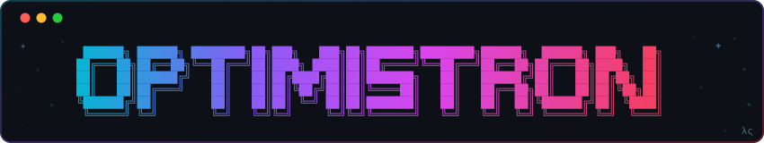
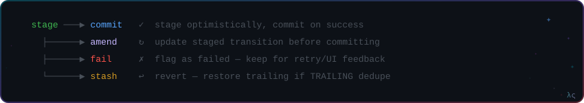

<p align="center">
  
</p>

<p align="center">
  <a href="https://redux.js.org/"></a>
  <a href="https://redux-toolkit.js.org/"></a>
</p>

> Opinionated optimistic state management for Redux. Tracks transitions alongside reducer state and derives the optimistic view at the selector level — like `git rebase`. No state copies. No checkpoints.

## When to use Optimistron

Optimistron is a good fit when your app has:

- **Offline-first flows** — users act while disconnected, transitions queue up, conflicts resolve on reconnect.
- **Async dispatch patterns** — thunks, sagas, listener middleware — anything where you dispatch an intent and later resolve it with success or failure.
- **Large or normalized state** — where snapshotting the full state tree per in-flight operation gets expensive fast.

Other libraries solve optimistic updates in their own way — snapshot/replay, cache patching, query-level invalidation. Optimistron is a different tradeoff: **no state copies, no checkpoints**. Optimistic state is derived at the selector level — which is already memoized by `reselect` in most Redux apps. You get optimistic UI on the read path, with zero write-path overhead.

> If you're already using RTK Query's built-in optimistic updates and they cover your needs, you probably don't need this.

---

## The Mental Model

Think of each reducer you wrap with `optimistron()` as a **branch** — not the whole store.

- **Committed state** = the branch tip. Source of truth — only `COMMIT` advances it.
- **Transitions** = staged commits on top of that branch. Intended changes that haven't landed yet.
- **`selectOptimistic`** = `rebase`. Replays transitions onto the branch tip at read-time. Never stored — always derived.
- **Sanitization** = conflict detection. After every mutation, transitions are replayed. No-ops get discarded. Conflicts get flagged.

`STAGE`, `AMEND`, `FAIL`, `STASH` never touch reducer state — they only modify the transitions list. The optimistic view updates because `selectOptimistic` re-derives it on the next read.

No `isLoading`, `error`, `isOptimistic` flags. A pending transition means loading. A failed one means error. A conflicting one means stale. One source of truth, zero boilerplate.

---

## Transition Lifecycle

<p align="center">
  
</p>

---

## Quick Start

```typescript
import { configureStore, createSelector } from '@reduxjs/toolkit';
import { optimistron, createTransitions, crudPrepare, indexedStateFactory } from '@lostsolution/optimistron';

type Todo = { id: string; value: string; done: boolean; revision: number };

const crud = crudPrepare<Todo>('id');
const createTodo = createTransitions('todos::add')(crud.create);
const editTodo = createTransitions('todos::edit')(crud.update);
const deleteTodo = createTransitions('todos::delete')(crud.remove);

const { reducer: todos, selectOptimistic } = optimistron(
    'todos',
    {} as Record<string, Todo>,
    indexedStateFactory<Todo>({
        itemIdKey: 'id',
        compare: (a) => (b) => (a.revision === b.revision ? 0 : a.revision > b.revision ? 1 : -1),
        eq: (a) => (b) => a.done === b.done && a.value === b.value,
    }),
    ({ getState, create, update, remove }, action) => {
        if (createTodo.match(action)) return create(action.payload.item);
        if (editTodo.match(action)) return update(action.payload.id, action.payload.item);
        if (deleteTodo.match(action)) return remove(action.payload.id);
        return getState();
    },
);

const store = configureStore({ reducer: { todos } });

const selectTodos = createSelector(
    (state) => state.todos,
    selectOptimistic((todos) => Object.values(todos.state)),
);

dispatch(createTodo.stage(todo));          // transitionId auto-detected from entity ID
dispatch(createTodo.commit(todo.id));      // persist on success
dispatch(createTodo.fail(todo.id, error)); // flag on error
```

---

## Rules

### Transition IDs

Every transition is tracked by a string ID — the **stable link** between a transition and the entity it describes. It's how `selectIsFailed(id)` and `selectIsOptimistic(id)` infer per-entity status.

**The recommended default is `transitionId === entityId`.** Use `crudPrepare` to couple them — `stage(entity)` automatically derives the transition ID from the entity's own key. For `amend`/`commit`/`fail`/`stash`, pass the transition ID explicitly (you already have it from the initial `stage`).

For edge-cases where transitionId must differ from entityId (batch ops, correlation IDs, server-assigned IDs with temp tokens), write custom prepare functions and pass transitionId as the first argument.

### Versioning

Entities need a **monotonically increasing version** — `revision`, `updatedAt`, anything orderable. The `compare` function uses this to determine if a transition is still valid, stale, or redundant during sanitization. Without it, conflict detection can't distinguish "newer" from "older".

### The rules

1. **One ID, one entity** — each transition ID resolves to a single entity.
2. **One at a time** — don't stage while one is already pending for the same ID.
3. **Granular** — one create, one update, or one delete per transition.

---

## Roadmap

- **Batch transitions** — stage multiple entities under a single correlation ID. Commit/fail/stash the batch atomically.
- **More state factories** — `singleEntityFactory` for scalar state, `normalizedStateFactory` for relational stores with foreign key handling.
- **Retry strategies** — configurable retry policies for failed transitions (exponential backoff, max attempts) built into the transition lifecycle.
- **Devtools integration** — Redux DevTools timeline visualization for transitions, sanitization events, and conflict detection.
- **Persistence adapters** — serialize/rehydrate pending transitions across page reloads (localStorage, IndexedDB).
- **Middleware hooks** — `onConflict`, `onStale`, `onSanitize` callbacks for custom side-effects without reducer coupling.

---

## Development

```bash
bun test              # run tests (coverage threshold 90%)
bun run build:esm     # build to lib/
```

See `usecases/` for working examples with async, thunks, and sagas.
